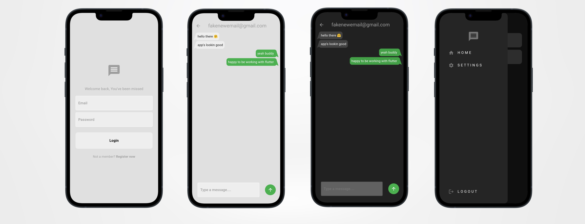

# Minimal Messenger 

## Overview 
This is a simple and minimal messneger app that user can make multiple emails to interact and chat with those emails. Theme switch has also been handled with bloc state management and is persistant. Firestore is used fore the chat database to show all the chat history, Firebase authentication is also used to make the users enabled to sign up or sign in to their account.

## Features 
 - **Main Activity** : Minimal chat application to send messages.
 - **Chat Features** : User can send message and see who is he/she sending the message to.
 - **Themes** : Dark and Light themes are used in the application and both are persistant with bloc state management and sharepreferences.

## Project Structure 
The project follows clean architecture for the separation of layers to keep everything ordered:

  - BLoC : To handle the logic of themes and send different themes in just one state.
  - Data : To handle one important layer when working in the app :
     - Model : which is the entity of the app and messages are defined in model.
  - Services : an important layer to interact and keep the functionalites of firebase in the application.
  - DI : Dependancy Injection which is also essential to keep all classes independant.
  - UI : Infrastructure layer that is aware of the inner layers and can interact with it.

## Dependancies 
  - firebase_core
  - cloud_firestore
  - firebase_auth
  - flutter_spinkit
  - chat_bubbles
  - shared_preferences
  - flutter_bloc
  - get_it

## Project Setup
To run the application do the following :

 1. Clone the repository or download it.
 2. Open the project in Android Studio / VScode.
 3. Build and run the app on an Android emulator or physical device by your choice.
